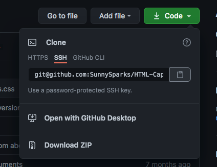
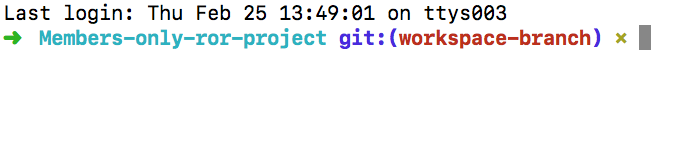
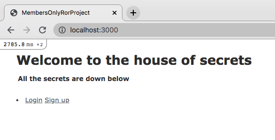

This application is built in Ruby and Ruby on Rails. With Members-only app, you can see a list of secrets created by users, if you're logged in you can see the author and destroy selected secrets.

###Built With

* Ruby

* Ruby on Rails

* Rubocop - linter

* Visual Studio Code

* Ruby gem Devise
  
###Setup

In order to run the application 

* 1 - Make a clone of the [repository:](https://github.com/SunnySparks/Members-only-ror-project) 

* 2 - Open the project directory with your preferred code editor (VSCode, Sublime Text, Etc).

* 3 - Open the terminal, drag and drop the project's folder into it and hit enter, make sure the route to the project is shown 

* 4 - Run `bundle install` within your terminal 

* 4 - Then still in the terminal type `rails s` in order to get the server up and running. 

* 5 - Go to your web browser and type the address http://localhost:3000/

* 6 - If it's the first time you open the project inside your browser, you will see an empty page, sign up in order to create your first secrets 

* 7 - After you are logged in, you will be able to see the secrets and the author's name 

* 8 - If you sign out you will see only the secrets, not the authors' identities 

* 9 - Please remember that everything you read is top secret and it mustn't be spread out of the secret community ;)

## Authors

👤 **José Francisco Silva Díaz**

- GitHub: [@SunnySpark](https://github.com/SunnySparks)
- Twitter: [@JosfranT6](https://twitter.com/JosFranT6)

### 🤝 Contributing

Contributions, issues and feature requests are welcome!

Feel free to check the [issues page](https://github.com/SunnySparks/Members-only-ror-project/issues).

### Show your support

Give a ⭐️ if you like this project!

### 📝 License

This project is [MIT Licensed](https://github.com/SunnySparks/Members-only-ror-project/blob/workspace-branch/LICENSE.MD)
